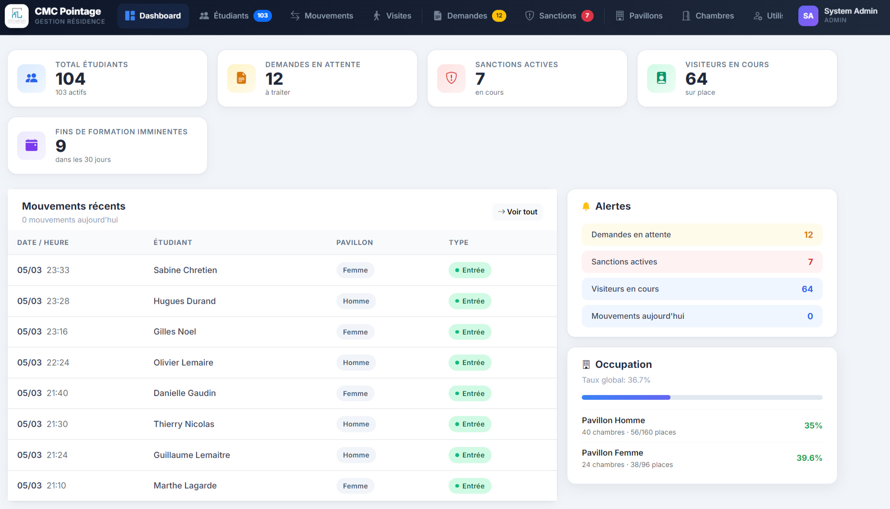
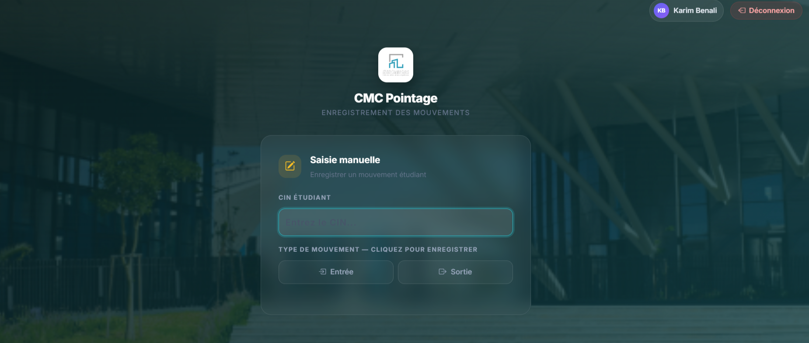

# CMC Pointage

Application Laravel de gestion de présence pour une cité universitaire (entrées/sorties des étudiants, affectation des chambres, demandes, sanctions, visites).

## Prérequis

- PHP 8.3+
- Composer
- Node.js + npm
- MySQL 8+ (ou MariaDB compatible)

## Installation

```bash
composer install
npm install
cp .env.example .env
php artisan key:generate
```

## Base de données

Le schéma de production vient du dump **`CMCpointage.sql`**, pas des migrations Laravel
(la migration ne définit qu'un schéma simplifié). Importer directement le dump :

```bash
mysql -u root -p -e "CREATE DATABASE cmc_p CHARACTER SET utf8mb4 COLLATE utf8mb4_unicode_ci;"
mysql -u root -p cmc_p < CMCpointage.sql
```

Puis configurer `.env` :

```env
DB_CONNECTION=mysql
DB_HOST=127.0.0.1
DB_PORT=3306
DB_DATABASE=cmc_p
DB_USERNAME=root
DB_PASSWORD=
```

⚠️ Ne pas exécuter `php artisan migrate` sur la base de production.

## Démarrage local

```bash
composer dev
```

Cette commande lance en parallèle :
- le serveur Laravel (`php artisan serve`)
- le worker de queue
- les logs (`php artisan pail`)
- Vite (`npm run dev`)

Vérifier l'installation sur `/setup`.

Compte admin par défaut : `admin@cmc.ma / password`

## Aperçu

**Dashboard** — vue d'ensemble des statistiques (étudiants, chambres occupées, mouvements du jour).



**Pointage** — scan du CIN pour basculer automatiquement l'entrée/sortie d'un étudiant.



## Tests

```bash
composer test
# ou : php artisan test
```

## Style de code

```bash
./vendor/bin/pint
```
